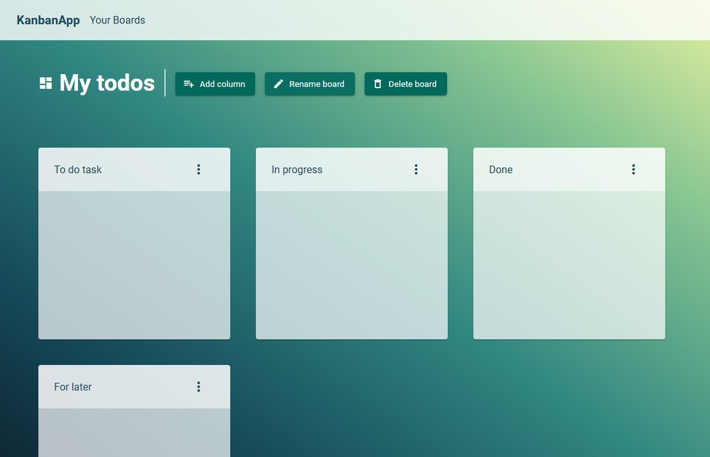

## General info

Application to manage your tasks or plans. You can create new windows and boards to better sort your tasks.
The application was built using Angular JS and Angular Material UI.



## Live site

[KanbanApp](https://app-kanban.netlify.app/)

## Setup

To run this project, install it locally using npm:

```
$ cd ../kanban-app
$ npm install
$ ng serve

```
